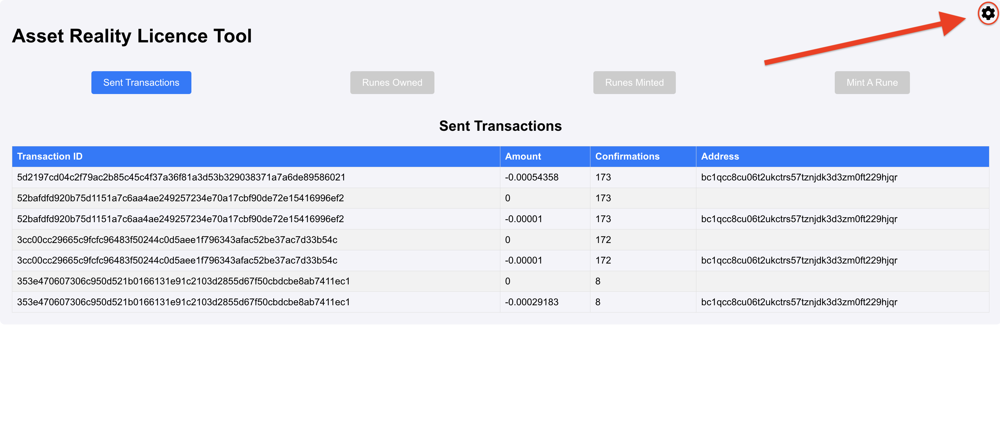
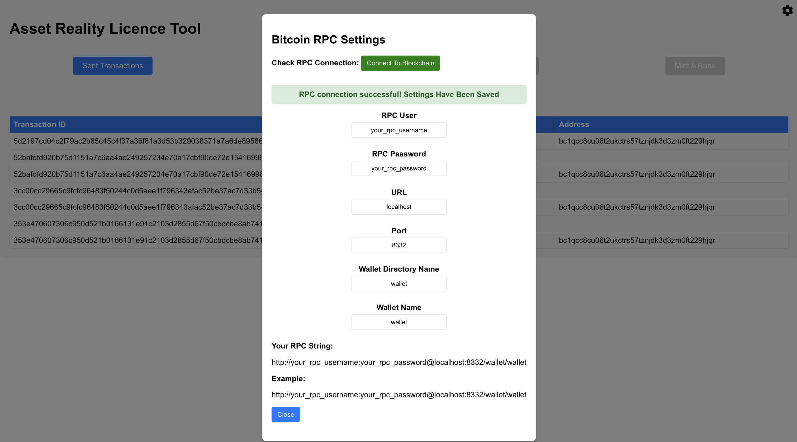

# Bitcoin Licence Tool

This Project is designed to create on-chain software licenses using Bitcoin Ordinals. A software license exists inside the OP_RETURN field of a UTXO

A software license contains json that matches the following: 

{"rune_id": unique_id, "issued_date": issued_timestamp}

## Prerequisites

You'll need a locally running bitcoin node to run this tool: https://bitcoin.org/en/bitcoin-core/

You'll need python and npm installed

If you're using a Mac, you'll need to run the following first:
```bash
brew install python@3.11
python3.11 -m venv .venv
source .venv/bin/activate
```

### Start the Tool
Once ready, run:
```bash
./start_services.sh
```


### RPC Settings
Check http://localhost:3000/ to view the tool

Check the rpc settings by clicking the gear icon in the top right corner



Apply the correct rpc settings and click Connect to Blockchain to test the connection




